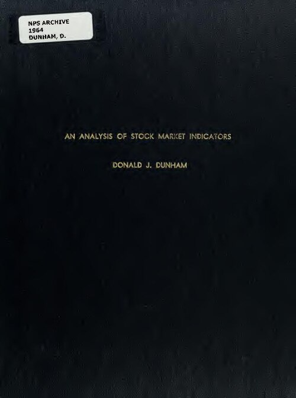

# 2026-06-30 交易日复盘：开盘-盘中-盘后决策日志

> **日期**：2026-06-30　**段落**：执行
> **市场温度**：偏弱　**情绪阶段**：上升
> **盘中看板**：成交额 21048.0亿 · 北向 暂无 · 涨跌停 90/3

## 二、盘中（执行）
- 盘中核心看板：两市成交额 21048.0亿，北向资金 暂无，涨停/跌停 90/3。
- 盘中执行以纪律优先，当前系统信心参考：33.5。
- 信号用于校验思路，不替代个人下单判断。
- 盘中观察要点：先做风险控制，减少逆势加仓与情绪化交易。; 等待缩量止跌或龙头反包后再提高仓位。
- AI卡片：bias=偏空，up/down=2/13，coverage=15。
- 涨停跌停卡片：90/3。

## 盘中打油诗

*配图说明：来源 Wikimedia Commons，公有领域 (Public Domain)。*

> 成交21048.0亿量能稳，偏弱格局未翻盘。
> 涨停90跌停3，情绪偏多盘略乱。
> 信心34莫追高，纪律先行最重要。
> 平均涨跌-1.36%，观察三笔不再敲。

## 风险提示与免责声明
风险提示与免责声明：本文仅为个人交易复盘与系统功能记录，不构成任何投资建议、收益承诺或个性化投顾服务。文中观点与信息仅供交流参考，可能存在滞后或误差，不作为买卖依据。市场有风险，决策需谨慎，所有交易后果由投资者自行承担。

## 原创说明
原创说明：本文为作者基于公开市场数据与个人交易复盘形成的原创内容，部分内容由本地系统辅助生成并经人工审校。