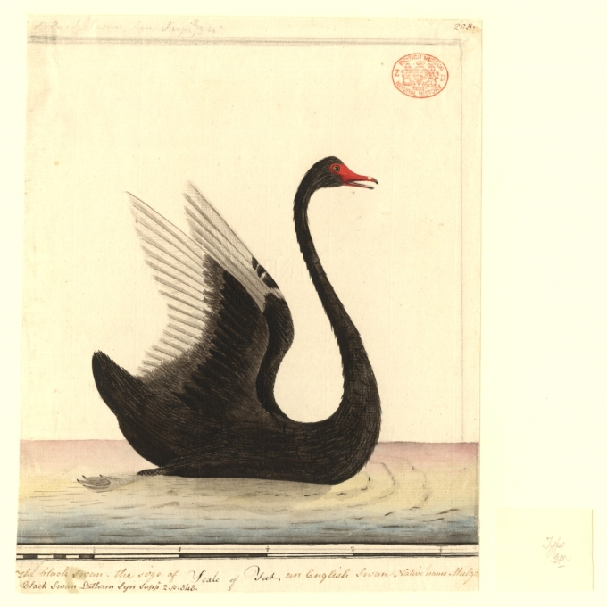

# 2026-07-01 交易日复盘：开盘-盘中-盘后决策日志

> **日期**：2026-07-01　**段落**：复盘
> **市场温度**：偏强　**情绪阶段**：上升
> **盘中看板**：成交额 36600.0亿 · 北向 暂无 · 涨跌停 暂无/暂无

## 三、盘后（复盘）
- 模式识别：有 2 笔买入未设止损，亏损易失控。
- 明日改进：明日硬约束：无止损不下单，止损位必须在建仓前写入。
- 盘后复盘先看过程再看结果：是否按计划执行、是否触发风控。
- 决策日志累计：171 条，已识别行为模式 3 项。
- 决策来源卡片：rule:169, manual:2。

## 今日要闻与风险事件（黑天鹅 / 灰犀牛）

*配图说明：交易纪律/冥想（空灵）主题意象配图，来源 Wikimedia Commons，公有领域 (Public Domain)。*

- 今日系统未自动捕获到达到黑天鹅 / 灰犀牛阈值的事件。

**今日宏观/政策头条（CCTV）**：
- 中共中央政治局召开会议 研究部署防汛抗旱工作 中共中央总书记习近平主持会议
- 庆祝中国共产党成立105周年音乐会《人民至上》在京举行
- 习近平同塞舌尔总统就中塞建交50周年互致贺电
- 庆祝中国共产党成立105周年大会7月1日上午在京隆重举行 习近平将向“七一勋章”获得者颁授勋章并发表重要讲话
- 对不起，可能是网络原因或无此页面，请稍后尝试。
- 人民日报任仲平文章：把握历史主动 实现伟大复兴——写在中国共产党成立105周年之际

*提示：黑天鹅 = 极小概率高冲击事件；灰犀牛 = 已知但被忽视的高概率风险。两者均不构成预测，仅作风险提醒。*

## 风险提示与免责声明
风险提示与免责声明：本文仅为个人交易复盘与系统功能记录，不构成任何投资建议、收益承诺或个性化投顾服务。文中观点与信息仅供交流参考，可能存在滞后或误差，不作为买卖依据。市场有风险，决策需谨慎，所有交易后果由投资者自行承担。

## 原创说明
原创说明：本文为作者基于公开市场数据与个人交易复盘形成的原创内容，部分内容由本地系统辅助生成并经人工审校。