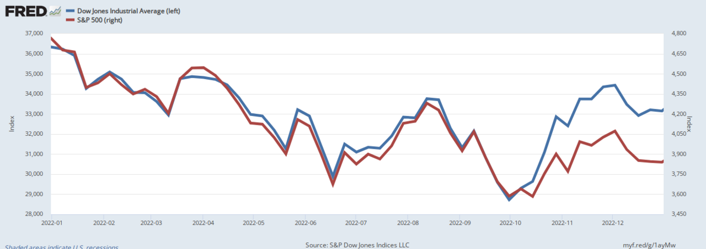

# 2026-07-02 交易日复盘：开盘-盘中-盘后决策日志

> **日期**：2026-07-02　**段落**：执行
> **市场温度**：震荡　**情绪阶段**：上升
> **盘中看板**：成交额 22420.0亿 · 北向 暂无 · 涨跌停 86/5

## 二、盘中（执行）
- 盘中核心看板：两市成交额 22420.0亿，北向资金 暂无，涨停/跌停 86/5。
- 盘中执行以纪律优先，当前系统信心参考：65.8。
- 信号用于校验思路，不替代个人下单判断。
- 盘中观察要点：维持中性仓位，执行快进快出与严格止损。; 只做相对强于指数的标的，弱势票不补仓。
- AI卡片：bias=中性震荡，up/down=8/6，coverage=15。
- 涨停跌停卡片：86/5。

## 盘中打油诗

*配图说明：交易纪律/冥想（空灵）主题意象配图，来源 Wikimedia Commons，公有领域 (Public Domain)。*

> 成交22420.0亿量能稳，震荡格局未翻盘。
> 涨停86跌停5，情绪偏多盘略乱。
> 信心66莫追高，纪律先行最重要。
> 平均涨跌0.41%，观察三笔不再敲。

## 风险提示与免责声明
风险提示与免责声明：本文仅为个人交易复盘与系统功能记录，不构成任何投资建议、收益承诺或个性化投顾服务。文中观点与信息仅供交流参考，可能存在滞后或误差，不作为买卖依据。市场有风险，决策需谨慎，所有交易后果由投资者自行承担。

## 原创说明
原创说明：本文为作者基于公开市场数据与个人交易复盘形成的原创内容，部分内容由本地系统辅助生成并经人工审校。